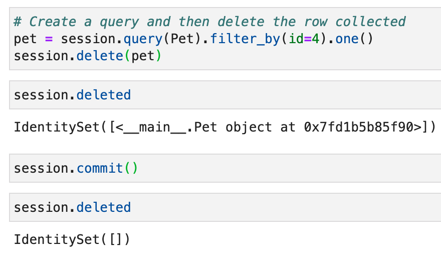
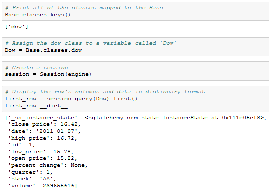
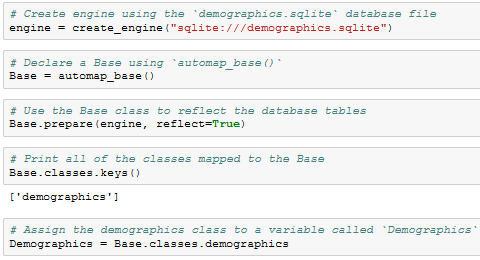

# 10.2 Advanced Usage of the SQLAlchemy ORM

## Overview

Today's lesson introduces students to some more of the nitty-gritty details of working with the SQLAlchemy ORM, including how to create complex queries, update rows, perform joins, and use ORM methods to perform queries.

## Class Objectives

* Students will be able to use the SQLAlchemy ORM to create classes that model tables.
* Students will be able to perform database CRUD operations using the SQLAlchemy ORM.
* Students will be able to reflect existing databases.
* Students will be able to use the SQLAlchemy Inspector to view table names in the database.
* Students will be able to plot the query results from the ORM.

## Instructor Prep

<details>
  <summary><strong>Instructor Notes</strong></summary>

* Please reference our [Student FAQ](../../../05-Instructor-Resources/README.md#Unit-10-advanced-data-storage-and-retrieval) for answers to questions frequently asked by students of this program. If you have any recommendations for additional questions, feel free to log an issue or a pull request with your desired additions.

</details>

<details>
  <summary><strong>Sample Class Video</strong></summary>

* To view an example class lecture visit (Note video may not reflect latest lesson plan):
  [Class Video 1](https://codingbootcamp.hosted.panopto.com/Panopto/Pages/Viewer.aspx?id=6fa4ab95-c06b-4cfd-987e-45b01c711a27)
  [Class Video 2](https://codingbootcamp.hosted.panopto.com/Panopto/Pages/Viewer.aspx?id=c9bfeaa7-d2ee-4271-aa73-5f302893d3b0)

</details>

- - -

# Class Activities

## 1. Welcome & SQLAlchemy Queries

| Activity Time:       0:20 |  Elapsed Time:      0:20  |
|---------------------------|---------------------------|

<details>
  <summary><strong>📣 1.1 Instructor Do: Welcome the Class (0:03)</strong></summary>

* Welcome the class back to their second day of SQLAlchemy. Today's class will focus on performing specific SQL tasks using SQLAlchemy's ORM. If some students feel that they are struggling to keep up, reassure them that they will be getting plenty of practice performing basic tasks with this library.

* Open the [slideshow](https://docs.google.com/presentation/d/1d0KRjGm0cFGZQP5Yqj_AUuoBr97PBPWY2u2Bw8dqZUk) and use slides 1 and 2 to welcome the class. Be sure to cover the following:

* Explain that in today's class will be taking a deeper dive into SQLAlchemy functionality. This class will especially focus on characterizing and querying databases.

* Explain to the students what the class objectives are for today:

  * Use SQLAlchemy ORM to model tables.

  * Perform CRUD with SQLAlchemy.

  * Reflect existing databases with SQLAlchemy.

  * Plot query results from SQLAlchemy ORM.

  * Run a t-test to validate differences in means.

</details>

<details>
  <summary><strong>📣 1.2 Instructor Do: SQLAlchemy Queries in Action (0:17)</strong></summary>

* Open the [slideshow](https://docs.google.com/presentation/d/1d0KRjGm0cFGZQP5Yqj_AUuoBr97PBPWY2u2Bw8dqZUk) and use slides 3-9 to introduce the next activity. Be sure to cover the following:

  * Crafting SQLAlchemy queries is actually quite a bit easier than one might first expect. To prove this point, we will be working with more realistic datasets today.

* Mention to the class that our first database contains over 1000 rows of data which can be searched through.

* Explain that in this activity, we will be reviewing concepts to demonstrate how SQLAlchemy can be used in conjunction with SciPy to perform analysis on a dataset.

  * For students pursuing a career in data science, it is important to practice this workflow on their own - the process of querying data, analyzing the output, making a hypothesis and then running a statistical test is a cornerstone in data science.

  * For those students who are not pursuing a career in data science, this workflow demonstrates how SQLAlchemy can interface with another common Python library using queried objects.

* Ask the students if anyone recalls how to query a database using SQLAlchemy.

* Remind students that there are two basic ways to query a database in SQLAlchemy - using SQL statements, and using Python objects.

* Remind students that last class we discussed it is preferred to use Python objects for interacting with a database in SQLAlchemy.

  * To query a database for all of the records in a specific table, use `session.query()` and pass the SQLAlchemy class that is associated with the table through as a parameter.

    ```python
    # Print all of the player names in the database
    players = session.query(BaseballPlayer)
    for player in players:
      print(player.name_given)
    ```

* Ask the students the following questions:

  * What is a t-test?

  * What is a t-test used for?

* Explain that the t-test is a statistical test used to determine the likelihood that the difference in the means of two groups is statistically significant.

  * The paired t-test compares the means of the _same_ group at different points in time, e.g. mean blood pressure in patients before and after medication.

  * The unpaired t-test compares the means of two different groups, e.g. the mean annual spending on dining out among Minnesotans vs. that of Texans.

* Open up [Ins_Basic_Querying.ipynb](Activities/01-Ins_Basic_Querying/Solved/Ins_Basic_Querying.ipynb) and go over the code with the class.

  * To create a query that looks into a specific column and selects only that data that passes a logic test, use the `session.query(<SQL Class>).filter()` method. When using this method, pass the class and column to query using dot notation and follow this with the test to perform.

    ```python
    # Find the number of players from the USA
    usa = session.query(BaseballPlayer).\
        filter(BaseballPlayer.birth_country == 'USA').count()
    print(f"There are {usa} players from the USA")

    # Find those players who were born before 1990
    born_before_1990 = session.query(BaseballPlayer).\
        filter(BaseballPlayer.birth_year < 1990).count()
    print(f"{born_before_1990} players were born before 1990")
    ```

  * Want to query multiple columns using and/or? SQLAlchemy can accomplish this as well by using `or_()` or `and_()` within the filter method and passing multiple logic tests in as parameters.

    ```python
    # Find those players from the USA who were born after 1989
    born_after_1989 = session.query(BaseballPlayer).\
        filter(BaseballPlayer.birth_year > 1989).filter(BaseballPlayer.birth_country == "USA").\
        count()
    print(f"{born_after_1989} USA players were born after 1989")
    ```

* Explain that the second part of the notebook asks the following question:

  * Is the height difference, if any, between players born before 1940 and those born in or after 1940 statistically significant?

  ```python
  born_before_1940_height = session.query(BaseballPlayer).\
    filter(BaseballPlayer.birth_year < 1940)
  ```

  * The same is done for players born in or after 1940.

  * These variables are assigned to SQLAlchemy objects. Each must be iterated upon to create a usable Python list.

* Briefly mention that there's a data-munging step to filter out non-integers from the lists:

  ```python
  pre_1940_height_list = []
  for player in born_before_1940_height:
      if type(player.height) == int:
          pre_1940_height_list.append(player.height)
  ```

  * Only values whose type is `int` are appended to the list of player heights.

* Explain that the `scipy` module is used to calculate the mean height of each group:

  ```python
  mean(pre_1940_height_list)
  mean(post_1940_height_list)
  ```

  * The difference in mean height in the two groups is over two inches.

* Ask the class which t-test would be appropriate to determine whether there's a statistically significant difference between the mean height of baseball players born before 1940, and those born in or after 1940.

  * The comparison here is between two different groups of people. Therefore the unpaired t-test is appropriate.

* Remind students that an unpaired (independent) t-test is run using `scipy.stats` to compare the means of two groups.

  ```python
  stats.ttest_ind(post_1940_height_list, pre_1940_height_list)
  ```

  * It returns a very small p-value that has been rounded down to zero, indicating that the difference between the two means is statistically significant.

* Answer any questions before moving on.

</details>

<sub>[Having issues with this activity? Report a bug!](https://bit.ly/347qiHj)</sub>

- - -

## 2. Shark Search

| Activity Time:       0:25 |  Elapsed Time:      0:40  |
|---------------------------|---------------------------|

<details>
  <summary><strong>✏️ 2.1 Students Do: Shark Search (0:20)</strong></summary>

* **Files**:

  * [02-Stu_SharkSearch/sharks.sql](Activities/02-Stu_SharkSearch/Resources/sharks.sql)

  * [02-Stu_SharkSearch/Stu_SharkSearch.ipynb](Activities/02-Stu_SharkSearch/Unsolved/Stu_SharkSearch.ipynb)

* **Instructions**: [02-Stu_SharkSearch/README.md](Activities/02-Stu_SharkSearch/README.md)

* Students will now take some time to create a Python script that can search through the SQL file of shark attacks provided.

* You may open the [slideshow](https://docs.google.com/presentation/d/1d0KRjGm0cFGZQP5Yqj_AUuoBr97PBPWY2u2Bw8dqZUk) and use slides 10-12 to accompany this activity.

</details>

<details>
  <summary><strong>⭐ 2.2 Review: Shark Search (0:05)</strong></summary>

* Open up the solution in [Activities/02-Stu_SharkSearch/Solved](Activities/02-Stu_SharkSearch/Solved/Stu_SharkSearch.ipynb), going through the code line-by-line and explaining the points below.

</details>

<sub>[Having issues with this activity? Report a bug!](https://bit.ly/3aGIgmh)</sub>

- - -

## 3. What a Cruddy Database

| Activity Time:       0:35 |  Elapsed Time:      1:15  |
|---------------------------|---------------------------|

<details>
  <summary><strong>📣 3.1 Instructor Do: Updating and Deleting Rows (0:10)</strong></summary>

* You may open the [slideshow](https://docs.google.com/presentation/d/1d0KRjGm0cFGZQP5Yqj_AUuoBr97PBPWY2u2Bw8dqZUk) and use slides 13-15 to introduce the next activity. Be sure to cover the following:

  * So far students have learned how to both create and read data from a SQL database using SQLAlchemy. To continue their way through the CRUD acronym, however, they must now learn how to update data.

* Open up [03-Ins_Basic_Updating](Activities/03-Ins_Basic_Updating/Solved/Ins_Basic_Updating.ipynb) within an IDE and run through the code with the class, explaining the following.

  * Performing updates is actually as simple as creating a query for the row(s) to modify and then altering the returned object(s) in the desired way.

  * Make sure to point out that `.first()` is used as well. Without the use of this additional method, the changes will not be made.

  * Since the record already exists within the external database, there is no need to perform as `session.add()`. Developers instead only need to use `session.commit()` to update the rows in the table.

    

* Deleting rows is also very easy as it too is an extension of SQLAlchemy's querying functionality.

  * Perform a query to locate the row to delete and then add the `.one()` method onto the end of the query statement to return one result.

  * To perform this modification, we'll use the `deleted` attribute.

  * Make sure to `session.commit()` for the delete to take effect.

    

  * Querying the table once more will show that Marshmallow has been removed.

* Finally, close the session with `session.close()`.

* Answer whatever questions the class may have before moving onto the next activity.

</details>

<details>
  <summary><strong>👥 3.2 Partners Do: What a Cruddy Database (0:20)</strong></summary>

* **Files**: [04-Par_CruddyDB/Par_CruddyDB.ipynb](Activities/04-Par_CruddyDB/Unsolved/Par_CruddyDB.ipynb)

* **Instructions**: [04-Par_CruddyDB/README.md](Activities/04-Par_CruddyDB/README.md)

* In this activity, pairs of students will be tasked with creating a new SQLite database for a garbage collection company. They will need to create a table, add rows into the table, update some values in some rows, and finally delete a row from the database.

* You may open the [slideshow](https://docs.google.com/presentation/d/1d0KRjGm0cFGZQP5Yqj_AUuoBr97PBPWY2u2Bw8dqZUk) and use slides 16-18 to accompany this activity.

</details>

<details>
  <summary><strong>⭐ 3.3 Review: What a Cruddy Database (0:05)</strong></summary>

* Open up the solution in [Activities/04-CruddyDB/Solved](Activities/04-Par_CruddyDB/Solved/Par_CruddyDB.ipynb) and go through the code line-by-line, explaining each cell as you progress through the notebook.

</details>

<sub>[Having issues with this activity? Report a bug!](https://bit.ly/345zlIS)</sub>

- - -

## Break

| Activity Time:       0:15 |  Elapsed Time:      1:30  |
|---------------------------|---------------------------|

- - -

## 4. Reflecting on SQL

| Activity Time:       0:35 |  Elapsed Time:      2:05  |
|---------------------------|---------------------------|

<details>
  <summary><strong>📣 4.1 Instructor Do: Reflections (0:10)</strong></summary>

* Open the [slideshow](https://docs.google.com/presentation/d/1d0KRjGm0cFGZQP5Yqj_AUuoBr97PBPWY2u2Bw8dqZUk) and use slides 20-24 to introduce the next activity. Be sure to cover the following:

* Point out that, as data analysts, developers often need to analyze already existing data sources. This would mean having to create SQLAlchemy classes according to a table's columns by hand every single time.

* Thankfully SQLAlchemy provides tools for automatically creating ORM classes from an existing database.

  * Explain that these tools will load the data from an existing database and use that data to infer how to write ORM classes for use "automagically".

  * Explain that this process is called **reflection**.

* Open up [05-Ins_Reflection](Activities/05-Ins_Reflection/Solved/Ins_Reflection.ipynb) within Jupyter Notebook and explain that reflecting an existing database is a simple, four-step process:

  * First, import `automap_base` in from the SQLAlchemy library

  * Then, create an `engine` against the existing database that should be reflected

  * Next, create a `Base` by calling `Base = automap_base()`

  * Finally, call `Base.prepare` with the `engine` from Step 2 and `reflect=True` as its parameters

    

* Point out that `automap_base` is similar to `declarative_base` but creates a different `Base` class with additional features.

  * In particular, the class returned by `automap_base` has a `prepare` method, which will "automagically" reflect the data in an existing database.

* Explain that it is possible to view the automagically generated ORM classes by examining `Base.classes.keys()`.

  * Point out that, by default, these keys will share the name of the underlying database tables they represent.

  * Explain that it is possible to access these classes via dot notation: `<ExampleClassName> = Base.classes.<ExampleClassName>`

* Explain that, after the database has been reflected, the autogenerated ORM classes can be used just like developers would use custom classes.

  * Demonstrate that it is possible to interact with the database using these autogenerated classes in conjunction with a `session`, just as before.

    

* Take a moment to answer any remaining student questions before moving on.

</details>

<details>
  <summary><strong>✏️ 4.2 Students Do: Reflecting on SQL (0:15)</strong></summary>

* **Files**:

  * [06-Stu_ReflectingOnSQL/Stu_Reflection.ipynb](Activities/06-Stu_ReflectingOnSQL/Solved/Stu_Reflection.ipynb)

  * [06-Stu_Reflecting/Resources/demographics.sqlite](Activities/06-Stu_ReflectingOnSQL/Resources/demographics.sqlite)

* **Instructions**: [06-Stu_ReflectingOnSQL/README.md](Activities/06-Stu_ReflectingOnSQL/README.md)

* Students will now practice their ability to reflect existing databases using SQLAlchemy and a SQLite table focused upon demographic data.

  

* You may open the [slideshow](https://docs.google.com/presentation/d/1d0KRjGm0cFGZQP5Yqj_AUuoBr97PBPWY2u2Bw8dqZUk) and use slides 25-27 to accompany this activity.

</details>

<details>
  <summary><strong>⭐ 4.3 Review: Reflection on SQL (0:05)</strong></summary>

* Open up the solution in [Activities/06-Stu_ReflectingOnSQL/Solved](Activities/06-Stu_ReflectingOnSQL/Solved/Stu_Reflection.ipynb), going through the code line-by-line and explaining the points below.

  * `Base` is instantiated with `automap_base` as opposed to `declarative_base`. `Base.prepare()` is then called, passing the SQL connection engine and the keyword argument `reflect=True` so as to create a reflection of the existing database.

  * A list of all of the reflected tables can be collected using `Base.classes.keys()`.

  * The class associated with a given table can be collected by referencing the appropriate property within `Base.classes`.

    

  * For the bonus, `group_by` allows one to "collapse" results that share a particular column value and then `count` can be used to count the number of rows returned by the query.

  * The query first creates a set for each demographic location that appears within the database and then counts the number of sets returned, thus yielding the number of unique locations represented in the database.

    

* Take a moment to answer any remaining student questions before moving onto the next activity.

</details>

<sub>[Having issues with this activity? Report a bug!](https://bit.ly/2UYSxnh)</sub>

- - -

## 5. Salary Exploration

| Activity Time:       0:25 |  Elapsed Time:      2:30  |
|---------------------------|---------------------------|

<details>
  <summary><strong>📣 5.1 Instructor Do: SQLAlchemy Exploration (0:10)</strong></summary>

* Reflecting a database to collect the classes stored within is fine and good, but it does not provide its users with any real knowledge on as to what information is being stored.

  * In order to collect that kind of information, developers would want to look into the columns for a table and their associated datatypes.

* The creators of SQLAlchemy thankfully understood that this would be something users desired from the library and, as such, created an inspector tool.

  * The inspector tool allows SQLAlchemy developers to look through a connected database and explore its contents.

  * Unlike session queries, the inspector is primarily used to look up tables, columns, and datatypes. Looking up the specific values stored within a table is where queries should be used.

* Open up [07-Ins_Exploration](Activities/07-Ins_Exploration/Solved/Ins_Inspector.ipynb) within Jupyter Notebook and go over the code line-by-line.

  * The `inspect` module for SQLAlchemy can be imported into a script alongside the `create_engine` module.

  * To create an inspector, create a variable and set it equal to `inspect(engine)`. This variable can then be used to inspect elements within the connected database.

  * To get the names of tables stored within the connected database, use `inspector.get_table_names()`.

    

  * To collect the columns within a table inside of the connected database, use `inspector.get_columns(<Table Name>)` and pass the name of the table through as a parameter.

  * Simply loop through the columns collected and it is then possible to print out their names and type using `column["name"]` and `column["type"]`.

    

* Answer whatever question students may have before moving on to the next activity.

</details>

<details>
  <summary><strong>✏️ 5.2 Students Do: Salary Exploration (0:15)</strong></summary>

* **Files**:

  * [08-Stu_SalaryExplore/database.sqlite](Activities/08-Stu_SalaryExplore/Resources/database.sqlite)

  * [08-Stu_SalaryExplore/Unsolved/Stu_Salary_Explorer.ipynb](Activities/08-Stu_SalaryExplore/Unsolved/Stu_Salary_Explorer.ipynb)

* **Instructions**: [08-Stu_SalaryExplore/README.md](Activities/08-Stu_SalaryExplore/README.md)

* Students will now take some time to create an inspector and search through a SQLite database of salaries from San Francisco.

* You may open the [slideshow](https://docs.google.com/presentation/d/1d0KRjGm0cFGZQP5Yqj_AUuoBr97PBPWY2u2Bw8dqZUk) and use slides 31-33 to accompany this activity.

</details>

<details>
  <summary><strong>⭐ 5.3 Instructor Do: Salary Exploration Review (0:05)</strong></summary>

* Open up the solution in [Activities/08-Stu_SalaryExplore/Solved/](Activities/08-Stu_SalaryExplore/Solved/Stu_Salary_Explorer.ipynb), going through the code line-by-line and answering whatever questions students may have.

</details>

<sub>[Having issues with this activity? Report a bug!](https://bit.ly/2UGoL8c)</sub>

- - -

## 6. Emoji Plotting

| Activity Time:       0:30 |  Elapsed Time:      3:00  |
|---------------------------|---------------------------|

<details>
  <summary><strong>✏️ 6.1 Groups Do: Emoji Plotting (0:25)</strong></summary>

* **Files**:

  * [09-Par_EmojiPlotting/emoji.sqlite](Activities/09-Par_EmojiPlotting/Resources/emoji.sqlite)

  * [09-Par_EmojiPlotting/Stu_Plotting.ipynb](Activities/09-Par_EmojiPlotting/Unsolved/Stu_Plotting.ipynb)

* **Instructions**:

  * [09-Par_EmojiPlotting/README.md](Activities/09-Par_EmojiPlotting/README.md)

* For this activity, students will join forces to create a plot based upon the data stored within a SQLite database. Using the knowledge they have accrued thus far and SQLAlchemy's documentation, they should be able to accomplish this task.

* You may open the [slideshow](https://docs.google.com/presentation/d/1d0KRjGm0cFGZQP5Yqj_AUuoBr97PBPWY2u2Bw8dqZUk) and use slides 34-36 to accompany this activity.

</details>

<details>
  <summary><strong>⭐ 6.2 Review: Emoji Plotting (0:05)</strong></summary>

* Open up the solution in [09-Par_EmojiPlotting/Stu_Plotting.ipynb](Activities/09-Par_EmojiPlotting/Solved/Stu_Plotting.ipynb), going through the code line-by-line and answering whatever questions students may have.

</details>

<sub>[Having issues with this activity? Report a bug!](https://bit.ly/2xPVApS)</sub>

- - -

### Copyright

Trilogy Education Services © 2019. All Rights Reserved.
