# 16.1 Introduction to D3 Graphing

## Overview

In today's class, students will expand upon their knowledge of the D3 library and start building bar charts.

### Class Objectives

* Students will gain a high-level understanding of SVG elements and how to append/modify them using D3.
* Students will understand how to bind data to SVG elements using D3 so as to create basic bar charts from scratch.
* Students will create a bar chart with axes using D3 so as to visualize data.

## Instructor Prep

<details>
  <summary><strong>Instructor Priorities</strong></summary>

* Students should have a firm understanding of scalable vector graphics and their benefits over other image formats.

* Students should be able to append SVG elements to a web page and style them according to a dataset

* The class should have a firm understanding of how to bind SVG elements to data through using D3.

* Students should feel confident in their ability to create a basic bar chart with axes using D3 and SVG elements.

</details>

<details>
  <summary><strong>Instructor Notes</strong></summary>

* The overall purpose of today's lesson is to have students create a basic bar chart and walk away with an understanding of some key D3 concepts.

* D3 can be very daunting at first. Let your students know that practice makes perfect in this case and that, the more they work with this library, the more sense it will make to them.

* Please reference our [Student FAQ](../../../05-Instructor-Resources/README.md#unit-16-d3) for answers to questions frequently asked by students of this program. If you have any recommendations for additional questions, feel free to log an issue or a pull request with your desired additions.

* Have your TAs reference the [6.3-TimeTracker](TimeTracker.xlsx) to help keep track of time during class.

</details>

<details>
  <summary><strong>Sample Class Video</strong></summary>

* To view an example class lecture visit (Note video may not reflect latest lesson plan):
  [Class Video](https://codingbootcamp.hosted.panopto.com/Panopto/Pages/Viewer.aspx?id=0d99d7a9-0342-41f4-94ca-a87b00084283)

</details>

- - -

# Class Activities

## 1. Welcome & Data Binding

| Activity Time:       0:35 |  Elapsed Time:      0:35  |
|---------------------------|---------------------------|

<details>
  <summary><strong>📣 1.1 Instructor Do: Welcome Class (0:05)</strong></summary>

* Take a moment to welcome your class and introduce them to this weeks topic: D3!

* We briefly discussed D3 a few weeks ago when we first began learning about web technologies, but we'll start class off by slacking out the following links for students to browse for a few minutes:

* [D3 Official Website](https://d3js.org/)

* [D3 Gallery](https://github.com/d3/d3/wiki/Gallery)

* Students should expect to be called on to tell the class something they've learned about D3.

* Send out the following files for students to reference as they progress through this week's activities:

  [D3_Reference_Guide](../Supplemental/D3_Reference_Guide.pdf)

  [StudentGuide](../StudentGuide.md)

</details>

<details>
  <summary><strong>🎉 1.2 Everyone Do: Talk about D3 (0:05)</strong></summary>

* After students have had a few minutes to browse the links slacked out, have a few volunteers tell the class what they were able to learn about D3.

* Try asking students the following:

  1. What does D3 stand for?

     * Data-Driven-Documents

  2. What language is D3 written in?

     * Plain JavaScript, it's a JavaScript library.

  3. What are some examples of types of charts that can be created with D3?

     * Bar Charts, Line Charts, Bubble Charts, Tree Layouts. Even maps such as Choropleth maps can be created using D3.

  4. What are some of D3's features?

     * **Selections**: D3 makes it simple to create, read, and update elements in the DOM with its easy to follow method chaining syntax.

     * **Transitions**: D3 makes animating and transitioning elements on the page a breeze.

     * **Data-Binding**: D3 allows us to associate data with elements in the DOM, or elements which will appear in the DOM later. With this, we bind the data once and can programmatically change and update parts of the DOM as the data changes.

</details>

<details>
  <summary><strong>🎉 1.3 Everyone Do: Data-Binding (0:25)</strong></summary>

* Instructor Notes:

  * This activity should be live coded in the console as along with students. It is designed for students to explore how D3 data binding affects DOM elements.

  * Use the [demo.js](Activities/01-Evr_Binding_Data/Solved/demo.js) for guidance as you live code.

  * Take time and allow students to follow along and catch up when needed.

* Open [index.html](Activities/01-Evr_Binding_Data/Solved/index.html) in a browser window, send out the [unsolved folder](Activities/01-Evr_Binding_Data/Unsolved) and ask students to open [index.html](Activities/01-Evr_Binding_Data/Unsolved/index.html) in a browser and follow along. A javascript file has also been included if they choose to use it for notes.

  1. **.each()**

  * First, review with students how to select DOM elements using D3. Ask the students how they would go about selecting all of the `li` elements inside of `ul` tag. This code returns a selection object containing all of the `li` elements from the DOM.

  

  * Chaining this selection object with the `.each()` method allows us to call a function on each of the elements in the object. In this case, we use the optional parameters `(d, i)` which, by default, is the data property of the element as well as its index in the selector object. This is very similar to using `.map()` or `.forEach()` to iterate through the array.

  * Here we use the `this` keyword to log the element.

  * The data object is undefined because we have yet to bind data to these elements.

    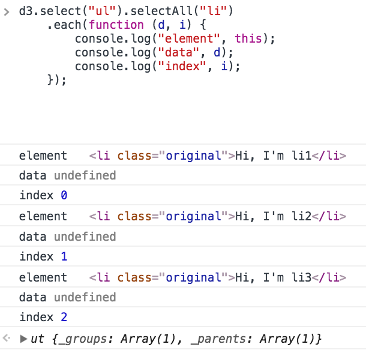

  2. **.data()**

  * Chaining .data() with the selector allows us to bind data to the selected elements.

  * Demonstrate to students that using the `.data()` method allows us to pass an array and each item in the array is bound to the elements one-by-one. However, if the array length does not match the number of elements in the selector object, not all elements may be updated or some of the items in the array may be ignored. We will address this further in part 4.

    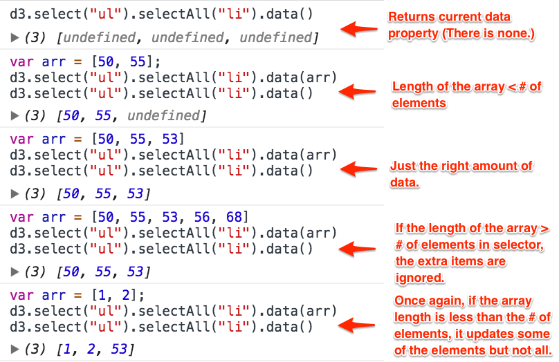

  * You may want to show students where the data property is changed within the selector object.

    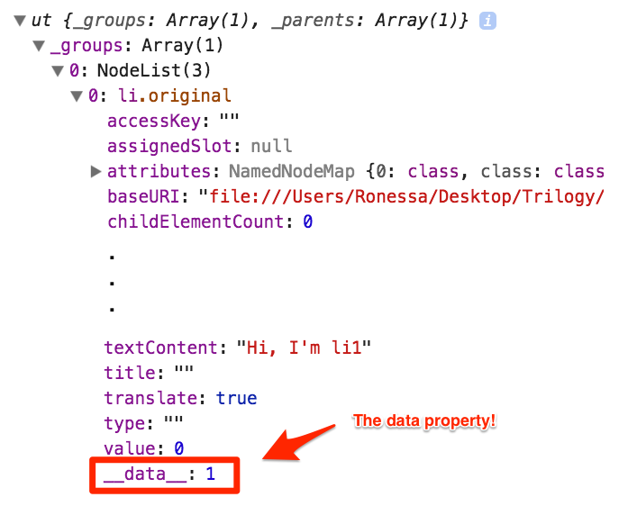

  3. **Multiple Methods**

  * Once data is bound to an element, we can use a variety of functions to manipulate those elements. Here, we use `text()` with a callback function. This callback function is called with each element in the selection.

  

  * We can also modify the data property before assigning new text.

    

  4. **.enter()**

  * As seen in Part 2, the `data()` method has limitations when the amount of data does not match the number of selected elements. Once again, demonstrate that this code ignores the last two items in the array because they are the only the elements with which to bind the data.

    

  * Show them attempting to append a new `li` will also not give them the desired result.

    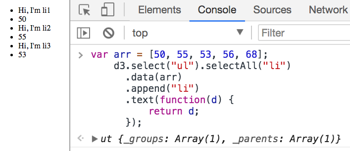

  * After running the above code, demonstrate the effect of the code by showing them the html elements in the inspector.

    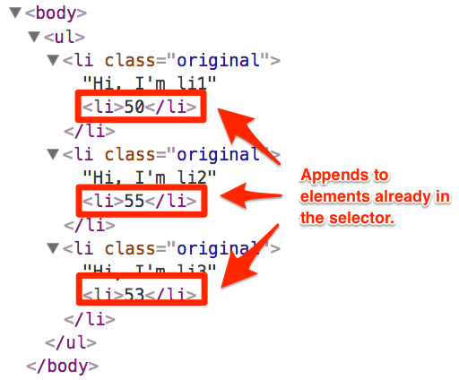

  * To handle additional data, we complete a two step process. First, we update the existing elements. Then, we create new elements by using `enter()` to create a sub-selection for the data that hasn't been mapped to an element yet. They are just waiting for a nice element to come along so they can settle down.

    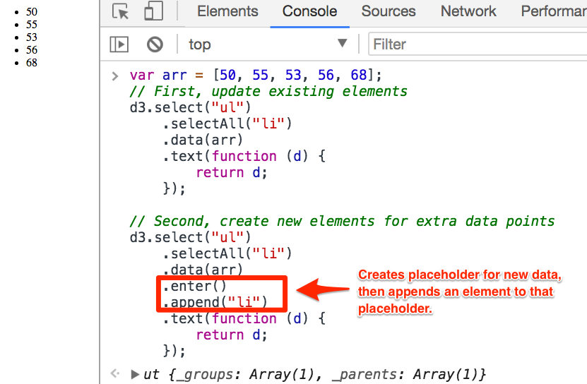

  * Note that we will cover an easier way to complete this process later.

  * Using `.enter()` without first updating the current elements will result in the original elements retaining their data property while new elements are created.

    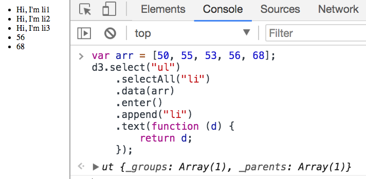

  5. **.exit()**

  * In order to remove an element based on the number of data properties, use `.exit()` and `.remove()`. `exit()` creates a selection of the surplus, and `.remove()` removes those elements from the DOM.

  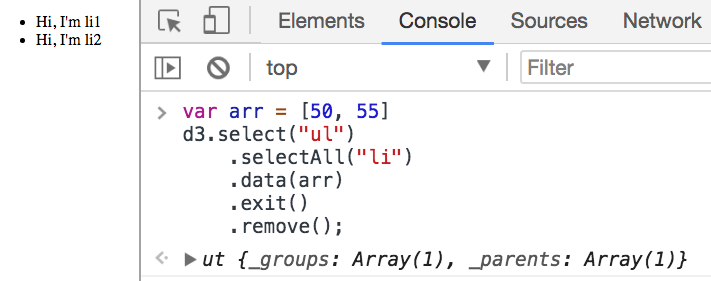

</details>

<sub>[Having issues with this activity? Report a bug!](https://bit.ly/2JSY3CJ)</sub>

- - -

## 2. D3 Table

| Activity Time:       0:25 |  Elapsed Time:      1:00  |
|---------------------------|---------------------------|

<details>
  <summary><strong>📣 2.1 Instructor Do: Data Binding Complex (0:05)</strong></summary>

* Open [index.html](Activities/02-Ins_Complex_Data/Solved/index.html) in a browser to demonstrate the application, then open the file in a text editor to show students the html.

  * The file uses bootstrap which gives access to their styling and classes.

  * There is a `div` with class `img-gallery` that also utilizes bootstrap's grid system with the `row` class.

  * The task will require creating a `div` with class `column-md-4`, as well as the class `thumbnail` for each gif from `complexData`.

* Open [demo.js](Activities/02-Ins_Complex_Data/Solved/index.html) and go over the code with students.

  * First, select the `div` with the class `img-gallery`.

  * Then, select all `div`s in the `img-gallery div` even though none currently exist. This ensures that we have the right selector object structure.

  * Use .data() with `.enter()` to create placeholder elements for the data (a.k.a. a virtual selection). Then, use `append("div")` to append a `div` element to those placeholders.

  * The `classed()` method allows us to assign these `div`s a class. The second parameter should be a boolean. `true` will add class to the element while `false` will remove that class.

  * Lastly, `html()` will allow us to set the html inside of those `div` elements to an image tag with a src url. Note that `d` refers to a single item from the array. In this case, each item is an object, so `d.url` refers to the url inside of the object.

  

  * View the changes in the browser console.

  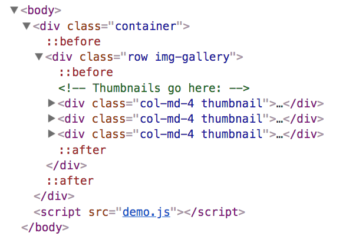

</details>

<details>
  <summary><strong>✏️ 2.2 Students Do: D3 Table (0:15)</strong></summary>

* In this activity students will create a D3 Table using data binding.

* Open [index.html](Activities/03-Stu_D3_Table/Solved/index.html) in a browser to demonstrate the final product.

* **Files:**

  * [index.html](Activities/03-Stu_D3_Table/Unsolved/index.html)

  * [table.js](Activities/03-Stu_D3_Table/Unsolved/table.js)

* **Instructions:**

  * Use the starter code provided to create a table using D3 data binding.

  * Your code should use D3 data binding to create a table from the `austin_weather` data provided.

* **Hint:**

  * Use the `.html()` method to add several `td` elements inside each table row.

</details>

<details>
  <summary><strong>⭐ 2.3 Review: D3 Table (0:05)</strong></summary>

* Open [table.js](Activities/03-Stu_D3_Table/Solved/table.js) and go over the code line-by-line with students.

* First, select `tbody` and then use `selectAll("tr")` to return a selector object.

* Then, bind the data, and use `enter()` in conjunction with `.append("tr")` to create table rows for each item in the austin_weather array.

* Finally, use the `html()` method to add table cells containing the information from each object in the array.

  

</details>

<sub>[Having issues with this activity? Report a bug!](https://bit.ly/2yAPTwu)</sub>

- - -

## 3. Enter, Exit, Update

| Activity Time:       0:10 |  Elapsed Time:      1:10  |
|---------------------------|---------------------------|

<details>
  <summary><strong>🎉 3.1 Everyone Do: Enter, Exit, Update (0:10)</strong></summary>

* Open [index.html](Activities/04-Evr_Enter_Exit_Update/Solved/index.html) in a browser. Send the [04-Evr_Enter_Exit_Update](Activities/04-Evr_Enter_Exit_Update/Solved) files to students so that they may follow along with the exercise.

* Open the inspector in the browser to show students the current html elements. Highlight for students that we used css styling to create blocks for the class `.temps`. Also point out that these elements are child elements of a div with the id `content`.

  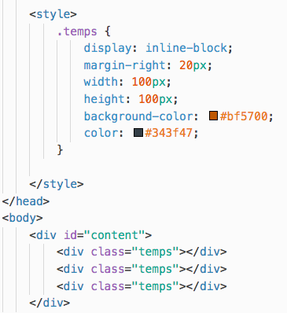

* Go through the sets of code in [demo.js](Activities/04-Evr_Enter_Exit_Update/Solved/index.html) by live coding or copy and pasting into the console.

  1. **Basic Data Bind**

  * Run the first set of code in the console so that students may see its effect. Ask a student to explain it to the class.

  * Make sure the following points are covered:

    * First, a selection is created that contains all of the divs with the class `temps`.

    * The `.data()` function is used to bind the data to each of the selected divs. After data binding, the style for each div element is changed using the `.style()` function. The `.style()` function uses the data bound to each element to change the height of the div by returning the concatenation of d (the integer in the austin_temps array) with px which is required to set the height.

    * Make sure to stress that this process only updates current elements. No additional elements are created to represent the last two items in the array.

    

  2. **Updating New Elements**

  * Refresh the browser so that students can correctly see the effect of the next piece of the code.

  * Run the code under #2 in the demo.js file in the console. Show the students that only the new elements are affected. Ask the students to volunteer an answer as to why that is the case.

    * Using `enter()` with `append()` creates a sub-selection of only new elements.

    * These must be given the correct class in order apply the original styling then adjust the height.

    

  3. **Only Updating Old Elements**

  * Refresh the browser and run the code in part 3. Give students some time to think about why the height of all the elements were not changed by this code before asking for a volunteer.

  * Highlight the following:

    * Once we chain the `selection` variable with `enter()` and `append()`  it creates a sub-selection of only the new elements.

    * Since we never return the sub-selection to a variable, when we style `selection`, it only styles the original elements. If we were to reassign the selection variable during the step with `enter()`, the styling changes would only be applied to the new elements.

    

  4. **Updating Old and New Elements**

  * Refresh the browser and either live code or copy/paste the code from part 4 into the console. Go over the code before showing students the output.

    * The use of `merge()` after appending new elements now changes the selection object to include both new and old elements.

    * Now, when we use `.style()` to update the height, all elements are affected.

    

  5. **Exit Pattern Revisited**

  * Before running part 5 in the console, refresh the page and go over the code.

    * The code here is designed to handle an array length of any size.

      * If there is additional data present, the code will append and merge those new items into the selection.

      * If there is less data than elements, the extra elements without bound data will simply be removed using the `.exit().remove()` sequence.

      

  6. **One Function to Handle Everything**

  * By putting the above sequence into a function as shown in part 6, we can handle any combination of data and elements. This is know as the `enter, update, exit pattern`.

  * Show students the function in part six and then demonstrate how it works for the data under Test 1 and Test 2.

    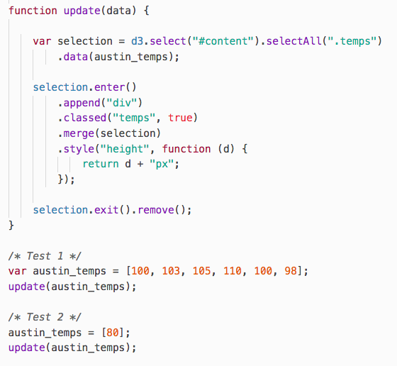

</details>

<sub>[Having issues with this activity? Report a bug!](https://bit.ly/2VaowRF)</sub>

- - -

## Break

| Activity Time:       0:15 |  Elapsed Time:      1:25  |
|---------------------------|---------------------------|

- - -

## 4. SVG Stickman

| Activity Time:       0:25 |  Elapsed Time:      1:50  |
|---------------------------|---------------------------|

<details>
  <summary><strong>📣 4.1 Instructor Do: SVG Elements (0:10)</strong></summary>

* Up to this point in time, we have been using HTML and CSS to create basic web pages and layouts but have not specifically used them to create unique images on the page. Through using **S**calable **V**ector **G**raphics, however, we can in a sense "draw" images on the page as if it were a painter's canvas.

  * SVG is an XML-based vector image format for two-dimensional graphics that supports interactivity and animation. All modern web browsers now include SVG rendering support.

  * As opposed to bitmap images (JPEG, GIF, PNG) which become more visibly pixelated when scaled up, SVG files can scale to any size and retain their smoothness. Send out the following link to show students an example of SVG vs. PNG at different scales. [SVG vs PNG](http://www.compatt.com/lab/IandA/IandA_00-00-02.htm)

* Open [05-Ins_SVG](Activities/05-Ins_SVG/Solved/index.html) both in a text editor and a browser and show the class how an SVG element is being used to draw shapes on the screen.

  * The `<svg>` tag tells the browser that we are going to be using scalable vector graphics to draw on the page. All of the shapes drawn are relative to the height wand width of this DOM.

  * The tags within the `<svg>` tells the browser which shape is being drawn.

    * Each shape has different requirements and standards for how the shape is drawn. For example, the `x` and `y` attributes in the `<rect>` tag refer the upper left hand corner of the shape while the circle requires a `cx` and `cy` attribute. These attributes refer to the center of the circle. A line requires two set of coordinates for the start and end of the line.

    

    * Change the attributes of the shapes to demonstrate how an SVG works.

      * Adjust the attributes of the elements. Show the students that if I shapes dimensions go beyond the dimensions of the SVG viewport, the shape is cut off.

      * Also, show the students that by default, the first element is at the "back" of the SVG while the last element is at the "front". In other words, the first element listed is "painted" first, then other elements can be "painted" on top.

      

    * We can also change the styling of the rectangle by applying CSS rules to it as well.

      

</details>

<details>
  <summary><strong>✏️ 4.2 Students Do: SVG Stickman (0:10)</strong></summary>

* In this activity, students will research and utilize SVG elements to create a stick figure.

* **Instructions:**

  * Create a new html file, then use SVG shapes to draw an SVG Stickman.

* **Hint:**

  * [SVG Shape Reference](https://developer.mozilla.org/en-US/docs/Web/SVG/Tutorial/Basic_Shapes)

</details>

<details>
  <summary><strong> 4.3 Review: SVG Stickman (0:05)</strong></summary>

* Since this is a student artist rendering of a stickman, they are bound to have different solutions. However, highlight the use of the `stroke`, `stroke-width`, and `fill` attributes here used to create an open circle.

  

</details>

<sub>[Having issues with this activity? Report a bug!](https://bit.ly/3bWJ0UP)</sub>

- - -

## 5. Data Rectangles

| Activity Time:       0:25 |  Elapsed Time:      2:15  |
|---------------------------|---------------------------|

<details>
  <summary><strong>📣 5.1 Everyone Do: D3 Bulls-eye (0:10)</strong></summary>

* The goal of this activity is to create a bulls-eye using data binding and SVG files.

* Open and send out [index.html](Activities/07-Evr_D3_Bullseye/Solved/index.html) and  students so that they may follow along as you live code using [demo.js](Activities/07-Evr_D3_Bullseye/Solved/demo.js) as a reference. Explain the code as you enter it line by line into the console.

* First, show students how to use D3 to create a single circle with an open center.

  1. Note that the `<body>` of the html is empty so all elements will be made from scratch.

  2. Add an `svg` element to the page and save it to a variable.

  3. Then, chain the variable with the `attr()` method to give assign its height and width.

  4. Append a single circle to the SVG and assign it the appropriate attributes.

```javascript
var svg = d3.select("body").append("svg")
svg.attr("width","100px").attr("height", "100px");

svg.append("circle")
  .attr("cx", 50)
  .attr("cy", 25)
  .attr("r", 25)
  .attr("stroke", "gray")
  .attr("stroke-width", "5")
  .attr("fill", "none")
```

* Refresh the page and explain that since concentric circles, like in a bulls-eye, have the same center coordinates, we can use D3 to bind an array of varying radii to `<circle>` elements and create 3 circles of varying size.

  1. Follow steps two and three from above to append an svg to the body and set its height and width.

  2. Create a selector object named `circles` by chaining the `svg` variable with  `selectAll("circles")`. Remember that this is required to set up the appropriate selector object structure.

  3. Create a variable to hold an array with data that will eventually be assigned to the radius, `r`, attribute. The array will have to hold values in descending order since the want to render the largest circle first and end with the smallest.

  4. Use the `enter()` and `append()` methods to create new circles bound to your array. All attributes remain constant except the radius.

```javascript
var svg = d3.select("body").append("svg");

svg.attr("width", "100px").attr("height", "100px");

var circles = svg.selectAll("circle");

var rValues = [40, 25, 10];

circles.data(rValues)
    .enter()
    .append("circle")
    .attr("cx", 50)
    .attr("cy", 50)
    .attr("r", function(d) {
      return d;
    })
    .attr("stroke", "black")
    .attr("stroke-width", "5")
    .attr("fill", "red");
```

  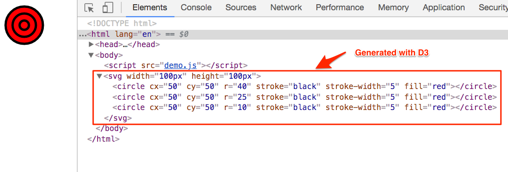

</details>

<details>
  <summary><strong>✏️ 5.2 Students Do: Data Rectangles (0:10)</strong></summary>

* This activity requires students to use D3 and data binding to append a rectangle with a dynamic height to the page.

* **Files:**

  * [index.html](Activities/08-Stu_Data_Rectangles/Unsolved/index.html)

  * [app.js](Activities/08-Stu_Data_Rectangles/Unsolved/app.js)

  * [style.css](Activities/08-Stu_Data_Rectangles/Unsolved/style.css)

  * [README.md](Activities/08-Stu_Data_Rectangles/README.md)

* **Instructions:**

  * Use the given javascript file and D3 to accomplish this following.

    1. Append an `SVG` element to the div provided in the starter html file. The SVG element should have a width of 600 px and a height of 400 px. Create a variable to reference this element.

    2. Bind the data from the given `booksReadThisYear` array and append a rectangle with a height ten times the value of the the item in the array.

* **Bonus**

  * Using the given css file, change your javascript so that when you hover over the rectangle it changes color.

</details>

<details>
  <summary><strong>⭐ 5.3 Review: Data Rectangles (0:05)</strong></summary>

* Open [app.js](Activities/08-Stu_Data_Rectangles/Solved/app.js) and go over the code with students.

  * First, we create an SVG element within the `<div>` with id `svg-area` with the height and width requested.

    * Explain that, although the exercises today created basic web applications with a single visualization, as they become more complicated it is common practice to use classes and ids to stay organized.

  * In a case this like this, where there is only one data point, one option is to append an element first and then bind it to the single item array. Here, the enter pattern was not necessary but it yields an equivalent result.

  * Then, set the attributes of the rectangle while setting the `height` dynamically.

  * For the bonus, the css file is given and can be utilized by simply using `classed()` to set the class of the rectangle to `bar`.

  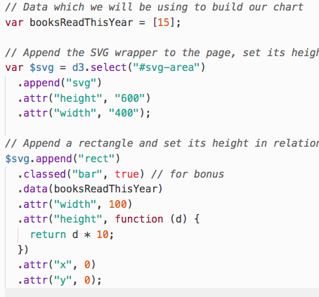

</details>

<sub>[Having issues with this activity? Report a bug!](https://bit.ly/2JNC0NT)</sub>

- - -

## 6. Upside Down Bar Chart

| Activity Time:       0:30 |  Elapsed Time:      2:45  |
|---------------------------|---------------------------|

<details>
  <summary><strong>✏️ 6.1 Student Do: Upside Down Bar Chart (0:20)</strong></summary>

* This activity builds off the last. Here, students build their own bar chart using data binding from a given dataset.

* **Files**

  * [index.html](Activities/09-Stu_UpsideDownBarChart/Unsolved/index.html)

  * [app.js](Activities/09-Stu_UpsideDownBarChart/Unsolved/app.js)

* **Instructions:**

  * Add code to [app.js](Activities/09-Stu_UpsideDownBarChart/Unsolved/app.js) in order to complete a bar chart using data binding.

  * Position and style each bar based on the data it represents.

* **Bonus:**

  * So far we have been making vertical bar charts exclusively... But we could also apply what we have learned thus far to making horizontal bar charts! Using your newfound knowledge of data-binding and graphing using D3, see if you can create a horizontal bar chart!

  * Since the next step in creating bar charts is to flip them right-side-up, experiment with your code a little bit and see if you can figure out how to manage this.

* **Hints:**

  * Look at the previous activities for reference!

  * See this [article on data-joins with D3](https://bost.ocks.org/mike/join/), written by D3 creator, Mike Bostock.

</details>

<details>
  <summary><strong>⭐ 6.2 Review: Upside Down Bar Chart (0:10)</strong></summary>

* While this activity is similar to [08-Stu_Data_Rectangles](Activities/08-Stu_Data_Rectangles/Solved), there are a couple of extra challenges involved.

* Open [09-Stu_UpsideDownBarChart](Activities/09-Stu_UpsideDownBarChart/Solved/app.js) and go over the code with students.

  * Create an svg inside of the id `svg-area` and set its height and width. Create a reference with a variable.

    

  * Create the appropriate selector object by using \`selectAll("rects").

  * Use the enter pattern.

  * Set width. Set height dynamically by increasing the data value by a factor of 10.

  * The x coordinate must move over by more than the width each time a rectangle is created. In this example, the width is 50px. In order to have a spacing of 10px, use a callback function with two parameters: d, for data, and i, for the index in the array. Increase the x coordinate of the bar by 60 each time by returning `i * 60`.

    

  * For the first bonus, creating a horizontal bar chart is as simple as flipping the x and y attributes. For example, create width and the y coordinate of the rectangle dynamically rather than the height and x-coordinate.

    

  * For the second bonus, explain that the bars are drawn from top down. In order for them to be flush with what would be the x-axis, you must move them down the svg element by the distance they are from the bottom. This can be calculated by taking the difference of the height of the svg and the height of the bar. Adding this piece of code to the vertical chart creation will accomplish this:

  

</details>

<sub>[Having issues with this activity? Report a bug!](https://bit.ly/39T8hxw)</sub>

- - -

## 7. Bar Chart Refactored

| Activity Time:       0:15 |  Elapsed Time:      3:00  |
|---------------------------|---------------------------|

<details>
  <summary><strong>🎉 7.1 Everyone Do: Bar Chart Refactored (0:10)</strong></summary>

* Have students keep their code from [09-Stu_UpsideDownBarChart](Activities/09-Stu_UpsideDownBarChart/) open for this next activity and have them follow along.

* Using [09-Stu_UpsideDownBarChart](Activities/09-Stu_UpsideDownBarChart/Solved/app.js) live code additions and changes until it matches [10-Evr_Groups](Activities/10-Evr_Bar_Chart_Refactored/Solved/app.js).

* Explain the following:

  * It is common practice to use `g` (group) tag for SVG elements. This allows changes like geometric transformations to be applied to the entire group.

  * After the code where a reference to the svg is created, create a variable called `svgGroup` by appending `g`, and using `attr()` to set the `transform` attribute equal to `translate(50, 100)`.

    * Explain to students that this means that the group will be moved right 50px and down 100px. 50 will be added to the original x-coordinate of the group, and 100 will be added to the original y coordinate of the group.

    * Send out this link to give students more reference on this topic: <https://bost.ocks.org/mike/d3/workshop/#107>

  * Replace `svg` before the `selectAll` method with `svgGroup` because we want to append the rectangles to the group inside of the SVG.

  

  * Open [10-Evr_Groups](Activities/10-Evr_Bar_Chart_Refactored/Solved/index.html) in a browser to show students the output of the code. Also open the inspector and show them how the group is organized.

  

</details>

<details>
  <summary><strong>📣 7.2 Demo Homework (0:05)</strong></summary>

* If time allows, show student what they will be able to create this week for the homework assignment.

  * Open [16-D3 HW Solution](../../../02-Homework/16-D3/Solutions), run a server, and open [index.html](../../../02-Homework/16-D3/Solutions) by visiting `localhost:8000`.

  * Click on the axis titles to show students how the graph transitions dynamically.

</details>

<sub>[Having issues with this activity? Report a bug!](https://bit.ly/3dXJAU9)</sub>

- - -

### Copyright

Trilogy Education Services © 2019. All Rights Reserved.
