# 21.1 Introduction to Machine Learning

## Overview

Today's lesson plan introduces students to classical machine learning algorithms in the context of [sklearn](http://scikit-learn.org/stable/), covering data preprocessing and common machine learning algorithms.

## Class Objectives

* Students will understand how to calculate and apply regression analysis to datasets.

* Students will understand the difference between linear and non-linear data.

* Students will understand how to quantify and validate linear models.

* Students will understand how to apply scaling and normalization as part of the data preprocessing step in machine learning.

## Instructor Prep

<details>
  <summary><strong>Instructor Notes</summary></strong>

* **INSTRUCTOR CONTENT NOTE:** If your class learned MySQL content (and _not_ PostgreSQL) during Unit 9, please teach Units 21, 22, and 23 using the `april/archived-content` branch by inputting `git checkout april/archived-content` in your terminal. You can continue to use the archive branch until the end of your course.

* Today's class introduces students to machine learning through the Scikit-Learn library. Scikit-Learn provides a consistent interface for all of their models that students should find encouraging.

* Some of the material today may feel repetitive (regression analysis), but it is important that students have a solid foundation in regression analysis both as a primary skill and as a building block for other machine learning algorithms.

* It is important to stress that the concept of creating a model, fitting (training) that model to the data, and then using it to make predictions has become the standard paradigm used in many modern machine learning libraries. This common interface makes it easy to experiment with new algorithms and libraries when exploring machine learning solutions. Students will learn that there is no single "right algorithm" to use for any particular dataset or problem and that experimentation and validation is often preferred. Students will learn to quantify and validate the performance of many models on a dataset to determine which model may be best suited for their needs.

* Please reference our [Student FAQ](../../../05-Instructor-Resources/README.md#unit-21-machine-learning) for answers to questions frequently asked by students of this program. If you have any recommendations for additional questions, feel free to log an issue or a pull request with your desired additions.

* Have your TAs refer to the [Time Tracker](TimeTracker.xlsx) to stay on track.

* Lastly, as a reminder these slideshows are for instructor use only - when distributing slides to students, please first export the slides to a PDF file. You may then send out the PDF file.

</details>


<details>
  <summary><strong>Sample Class Video</strong></summary>

* To view an example class lecture visit (Note video may not reflect latest lesson plan): [Class Video](https://codingbootcamp.hosted.panopto.com/Panopto/Pages/Viewer.aspx?id=9644eee9-4673-4107-bfc7-a89100f924ba)

</details>

- - -

# Class Activities

| Activity Time:       0:50 |  Elapsed Time:      0:50  |
|---------------------------|---------------------------|


## 1. Introduction to Machine Learning & Linear Regression

<details>
  <summary><strong> 📣 1.1 Instructor Do: Introduction to Machine Learning (0:15)</strong></summary>

* Step through the introduction to machine learning [slideshow](https://docs.google.com/presentation/d/1dhMpfebH1XYU4ElVvbZetkuknsacWw33aGM1W_pirNI/edit?usp=sharing) slides 1-26.

</details>

<details>
  <summary><strong> 📣 1.2 Instructor Do: Univariate Linear Regression (0:10)</strong></summary>

* **Files**:
  [Ins_Univariate_Linear_Regression_Sklearn.ipynb](Activities/01-Ins_Univariate_Linear_Regression_Sklearn/Solved/Ins_Univariate_Linear_Regression_Sklearn.ipynb)

* Start this activity by walking students through the [slideshow](https://docs.google.com/presentation/d/1dhMpfebH1XYU4ElVvbZetkuknsacWw33aGM1W_pirNI/edit?usp=sharing) slides 27-33. Be sure to cover the following talking points:

* Explain that for the remainder of the course we will be utilizing Python to perform more advanced data modelling and analysis techniques. Therefore it is critical that we ensure our Python environments have the necessary libraries and there are no incompatibilities from previous libraries.

* Explain that we can ensure a clean and up-to-date environment by making a new anaconda environment that we will use for the rest of the course.

* Next ask the students to run `conda deactivate` then have them create the `PythonAdv` environment using the [yaml file](Activities/01-Ins_Univariate_Linear_Regression_Sklearn/Resources/python_adv.yml). Enter the command `conda env create --file <path to python_adv.yml>` to install the dependencies.

  * Warn students that this may take a few minutes to install.

  * Alternatively, you may have the students open their GitBash/Terminal inside of the folder with the yaml file on their computer. Then run the same command without the absolute path to requirements file (but still include the requirements file name in the arguments).
 
  * Windows or Mac: `conda env create --file python_adv.yml`
   
* Finally, enter `source activate PythonAdv` to activate the environment. When `(PythonAdv)$` appears, this means you are in the environment.

* Explain that now we are ready to jump into our advanced Python topics starting by revisiting an algorithm we are already familiar with - linear regression.

* Explain that linear regression is one of the fundamental algorithms in machine learning and is often used as a building block for other Machine Learning algorithms such as neural networks and deep learning.

* Ask a student if they can define linear regression again.

  * Remind students that linear regression is used in data science to model and predict the relationship between dependent and independent factors. Simple linear regression tries to predict a dependent variable from one single independent variable (also referred to as a feature or factor in machine learning). In contrast, multiple linear regression tries to predict a dependent variable from multiple independent features.

  * Remind students that linear regression calculates the coefficients for the slope and intercept to create a linear equation - **y = mx +b**.

    * However when dealing with polynomials and features, linear regression attempts to determine a coefficient for each feature. In other words linear regression calculates a weighted value for each feature in order to determine an optimal linear equation.

* Explain that linear Regression is fast! If the problem can be solved with linear regression, that it is often more efficient and economical to use LR over a more complex model such as deep learning.

  * Many data scientists start with a linear regression model and only move onto a more complex algorithm if their data proves to be truly non-linear.

* Open the [Jupyter Notebook file](Activities/01-Ins_Univariate_Linear_Regression_Sklearn/Solved/Ins_Univariate_Linear_Regression_Sklearn.ipynb) and walk through the code.

  * Explain that we will use a Sklearn function called `make_regression` to generate some test data.

    * Walk through the parameter list for `make_regression` and explain that we are defining 20 samples (rows) with 1 feature (column) and some noise and bias.

  * Use Matplotlib to plot the data and show the linear trend.

    * Explain that as X increases, y increases by a rate that is roughly constant.

      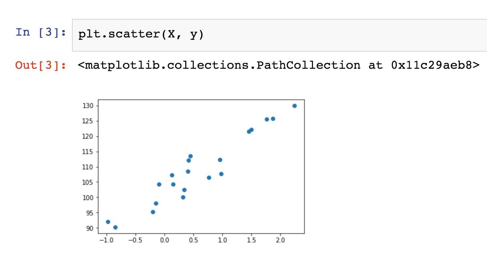

  * Explain that linear data can also have a negative trend; as the independent value (x) increases, the dependent value (y) decreases.

* Show the formula for Univariate Linear Regression and explain that this is just finding a line that best fits the data.

  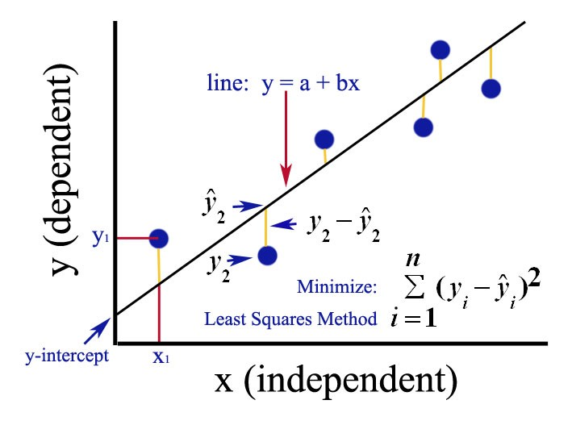

* Use the home price example to illustrate the process of acquiring new data (a new house on the market) and using linear regression to predict the home price.

  

* Briefly discuss non-linear data using the examples provided in the slideshow.

  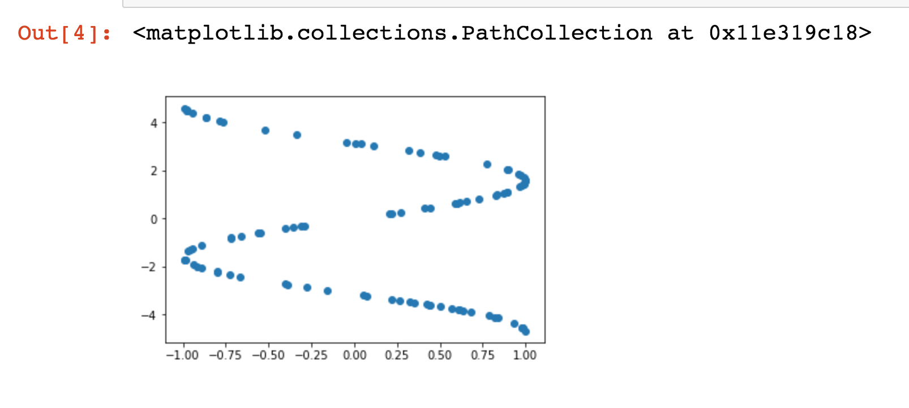

* Model - Fit - Predict

  * Explain that many popular machine learning libraries follow a model - fit - predict pattern. Walk the students through an example of this using Linear Regression in sklearn.

    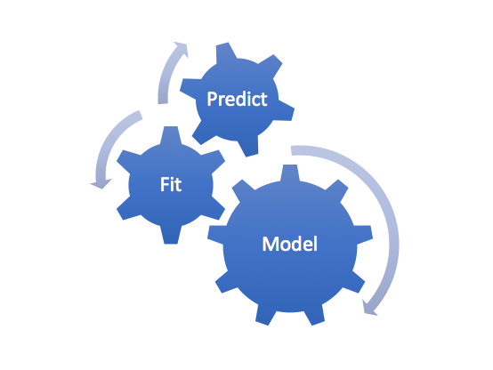

  * Explain that we are going to import `LinearRegression` from Sklearn and instantiate a model from it.

  * Explain that once we have a model instantiated, we need to fit the model to the data. This is the training process.

    * Explain that the goal with training is to find the slope and intercept that best represents the data (fitting a line to the data).

  * Show the slope and intercept for the model using `model.coef_` for the slope and `model.intercept_` for the y-axis intercept.

    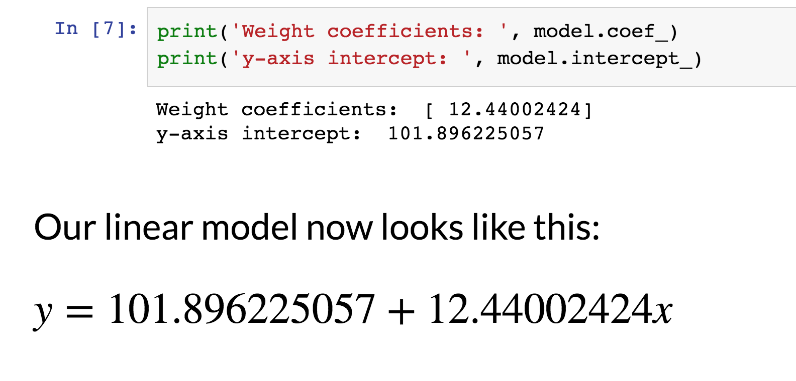

  * Explain that we can now use the line to make predictions for new inputs. We now have a model that can take any value of X and calculate a value of y that follows the trend of the original data.

  * The format for passing values into `model.predict()` is a list of lists.

  ```python
  y_min_predicted = model.predict([[x_min]])
  y_max_predicted = model.predict([[x_max]])
  ```

  * Compare the first prediction to the original output value. These two values should be very close to each other because the model represents the trend of the original data.

  * Use the min and max values for X to make predictions for y. Compare that to the original data to show that they should be fairly close in value.

  * Plot the original data vs the predicted min and max values. This will visually show how well the model fits the original data.

    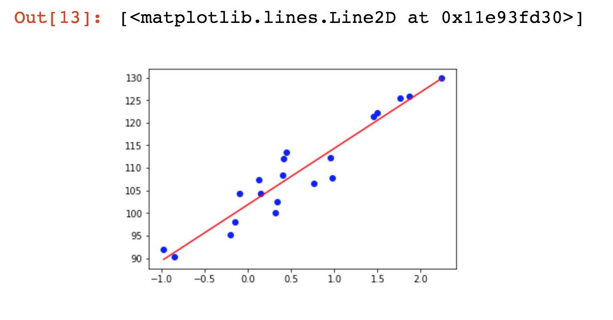

</details>

<details>
  <summary><strong> ✏️ 1.3 Students Do: LSD Regression Line (0:15)</summary></strong>

* In this activity, students calculate a regression line using a dataset of LSD drug concentrations vs. math scores.

* **File**: [Stu_LSD.ipynb](Activities/02-Stu_LSD_Regression/Unsolved/Stu_LSD.ipynb)

* **Instructions:** [README.md](Activities/02-Stu_LSD_Regression/README.md)

  * Start by creating a scatter plot of the data to visually see if any linear trend exists.

  * Next, use sklearn's linear regression model and fit the model to the data.

    * Print the weight coefficients and the y-axis intercept for the trained model.

  * Calculate the `y_min` and `y_max` values using `model.predict`

  * Plot the model fit line using `[x_min[0], x_max[0]], [y_min[0], y_max[0]]`

</details>

<details>
  <summary><strong> ⭐ 1.4 Review Activity (0:10) </summary></strong>

* Reassure students that it's okay if this was difficult. The Sklearn and TensorFlow libraries share a common API, so once you master the `Model-Fit-Predict` steps, it is easy to switch to other Machine Learning Models later one. They will get plenty of practice with this today!

* Open up [Stu_LSD.ipynb](Activities/02-Stu_LSD_Regression/Solved/Stu_LSD.ipynb).

* During the review, highlight the following points:

  * Show how to assign the data and target to variables `X` and `y`.

    * Explain that it is not necessary to use `X` and  `y`, but it does provide a consistent set of variable names to use with our models.

    * Explain that we have to call `reshape(-1, 1)` to format the array for sklearn. This is only necessary for 1-dimensional array.

    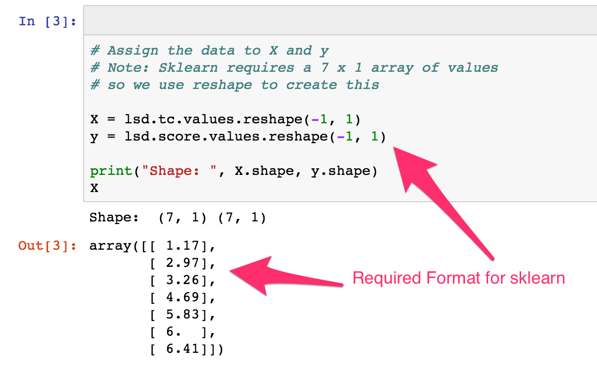

    * Explain that the `x_min` and `x_max` values are transformed to fit the list of lists formats required for `model.predict()`.

  ```python
  x_min = np.array([[X.min()]])
  x_max = np.array([[X.max()]])
  print(f"Min X Value: {x_min}")
  print(f"Max X Value: {x_max}")
  ```

  * Plot **x** and **y** to show the linear trend in the data.

    * Point out that it is ok to have a negative slope in this case. The data still follows a linear trend.

      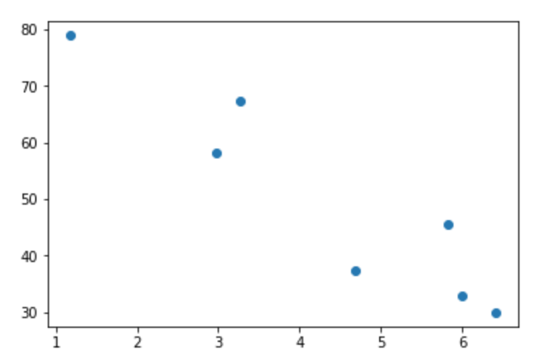

  * Show how to instantiate and fit a model to the data.

  * Print the slope and intercept values and remind students that we are simply defining the equation for the line.

  * Plot the line and the original data to show visually how well the line fits the model.

  * Ask students what it might mean if the line did not appear to match the data well. Explain that it may indicate that the model was not a good fit, or that there were errors somewhere in the code.

    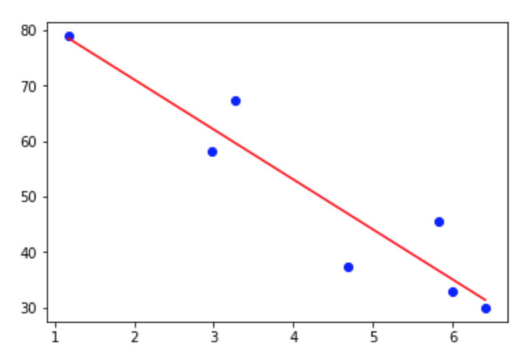

</details>

<sub>[Having issues with this activity? Report a bug!](https://bit.ly/2XfJb9E)</sub>

## 2. Metrics to Quantify Machine Learning Models

| Activity Time:       0:35 |  Elapsed Time:      1:25  |
|---------------------------|---------------------------|

<details>
  <summary><strong> 📣 2.1 Instructor Do: Quantifying Regression (0:10) </summary></strong>

* In this activity, two popular metrics to quantify their machine learning models are shown. The importance of validation by splitting data into training and testing sets is also covered.

* Open the [slideshow](https://docs.google.com/presentation/d/1dhMpfebH1XYU4ElVvbZetkuknsacWw33aGM1W_pirNI/edit?usp=sharing) to go over slides 33-39 and open [Ins_Quantifying_Regression.ipynb](Activities/03-Ins_Quantifying_Regression/Solved/Ins_Quantifying_Regression.ipynb) in Jupyter Notebook.

* Quantification

  * Go over slide 28 while explaining that more than visual confirmation of a model is necessary to judge its strength. The model must be quantified. Two common quantification scores are **Mean Squared Error (MSE)** and **R Squared (R2)**.

  * Sklearn provides functions to calculate these metrics.

  * Switch to [Ins_Quantifying_Regression.ipynb](Activities/03-Ins_Quantifying_Regression/Solved/Ins_Quantifying_Regression.ipynb) to show how to use `sklearn.metrics` to calculate the **MSE** and **R2** scores.

  * Point out that a "good" MSE score will be close to zero while a "good" R2 Score will be close to 1.

  * Explain that R2 is the default score for a majority of Sklearn models. It can be calculated directly from the model using `model.score`.

* Validation

  * Switch back to the [slideshow](https://docs.google.com/presentation/d/1dhMpfebH1XYU4ElVvbZetkuknsacWw33aGM1W_pirNI/edit?usp=sharing) and go over slides 29-32.

  * In order to understand how the model performs on new data, the data is split into training and testing datasets. The model is fit (trained) using training data, and scored/validated using the testing data.  This gives an unbiased measure of model effectiveness.

  * This train/test splitting is so common that Sklearn provides a mechanism for doing this. Show students how to use the `train_test_split` function to split the data into training and testing data using [Ins_Quantifying_Regression.ipynb](Activities/03-Ins_Quantifying_Regression/Solved/Ins_Quantifying_Regression.ipynb).

</details>

<details>
  <summary><strong> ✏️ 2.2 Students Do: Brains! (0:15) </summary></strong>

* In this activity, students calculate a regression line to predict head size vs. brain weight.

* **File**: [Stu_Brains.ipynb](Activities/04-Stu_Brains_Regression/Unsolved/Stu_Brains.ipynb)

* **Instructions:** [README.md](Activities/04-Stu_Brains_Regression/README.md)

  * Start by creating a scatter plot of the data to visually see if any linear trend exists.

  * Split the data into training and testing using sklearn's `train_test_split` function.

  * Next, use sklearn's linear regression model and fit the model to the training data.

  * Use the test data to make new predictions. Calculate the MSE and R2 score for those predictions.

  * Use `model.score` to calculate the the R2 score for the test data.

  </details>

<details>
  <summary><strong> ⭐ Review Activity (0:10) </summary></strong>

* Remind students that the data must be reshaped because sklearn expects the data in a particular format.

* Ask the students why the MSE score is so large. Explain that this is because MSE is not upper bounded. Optionally, send out the formula for [MSE](https://en.wikipedia.org/wiki/Mean_squared_error).

* Highlight is that the model should always perform better on the training set than the testing set. This because the model was trained on the training data and not on the testing data. Intuitively, the model should perform better on data that it has seen before versus data it has not seen.

* Note that `r2_score` and `model.score` produce the same R2 score.

</details>

<sub>[Having issues with this activity? Report a bug!](https://bit.ly/39U969i)</sub>


- - -

## BREAK

| Activity Time:       0:15 |  Elapsed Time:      1:40  |
|---------------------------|---------------------------|

- - -

## 3. Multiple Linear Regression

| Activity Time:       0:35 |  Elapsed Time:      2:15  |
|---------------------------|---------------------------|

<details>
  <summary><strong> 📣 3.1 Instructor Do: Multiple Linear Regression (0:10)</summary></strong>

* In this activity, we discuss multiple (multi-feature) linear regression.

  * Explain that multiple linear regression is linear regression using multiple input features. Use the house price example as an analogy. Linear regression could predict the price of a home dependent on one feature: square feet.  Multiple linear regression allows multiple inputs such as the number of bedrooms, number of bathrooms, as well as square feet.

      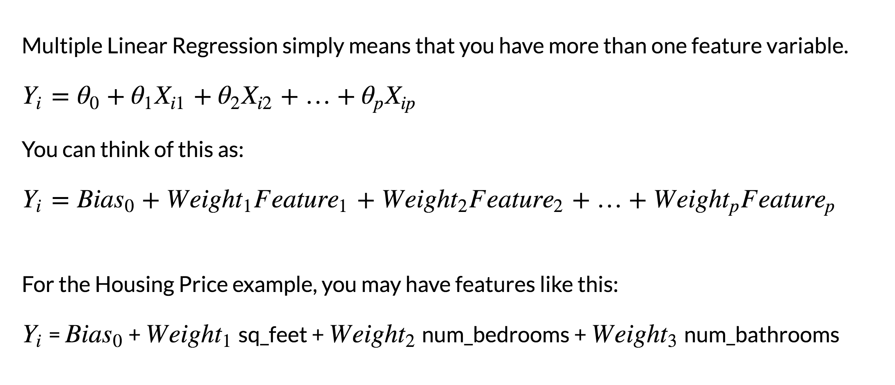

  * Explain that with multiple linear regression, it becomes hard to visualize the linear trends in the data. We need to rely on our regression model to correctly fit a line. Sklearn uses the Ordinary Least Squares method for fitting the line. Luckily for us, the api to the linear model is exactly the same as before! We simply fit our data to our n-dimensional X array.

      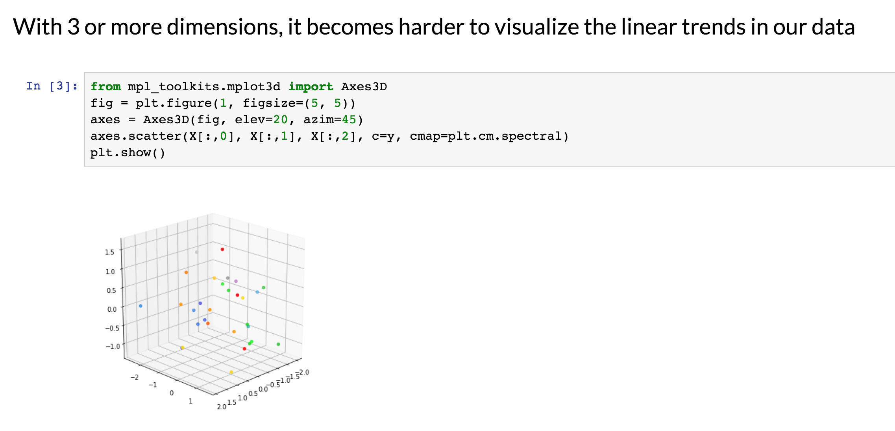

* Residuals

  * Explain that with multi-dimensional data, we need a new way to visualize our model performance. In this example, we use a residual plot to check our prediction performance. Residuals are the difference between the true values of y and the predicted values of y.

      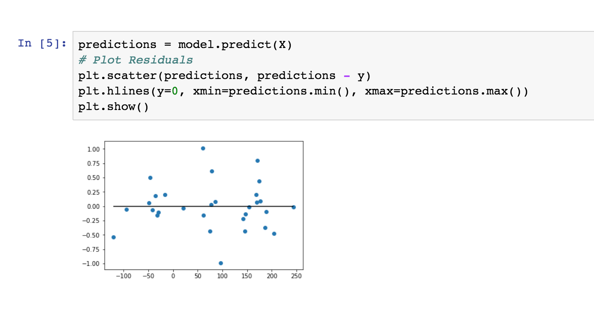

</details>

<details>
  <summary><strong> ✏️ 3.2 Students Do: Beer Foam - Multiple Regression (0:15) </summary></strong>

* **File**: [Stu_Beer_Foam.ipynb](Activities/06-Stu_Beer_Foam_MultipleRegression/Unsolved/Stu_Beer_Foam.ipynb)

</details>

<details>
  <summary><strong> ⭐ 3.3 Review Activity (0:10) </summary></strong>

* Explain that we are now using 2 features for our X data, `foam` and `beer`. Using more than one feature (independent variable) is considered multiple regression.

* Show that our api is the same. That is, we still use the model, fit, predict interface with sklearn. Only the dimensionality of the data has changed. Point out that we do not have to `reshape` our X data because it is already in the format that sklearn expects. Only 1 dimensional input vectors have to be reshaped.

* Explain that we will often see a higher r2 score using multiple regression over simple (1 independent variable) regression. This is because we are using more data to make our predictions.

* Show the residual plot for this model using both training and testing data. We do have outliers in this plot which may indicate that our model would not perform as expected. It's hard to say without testing with more data points.

    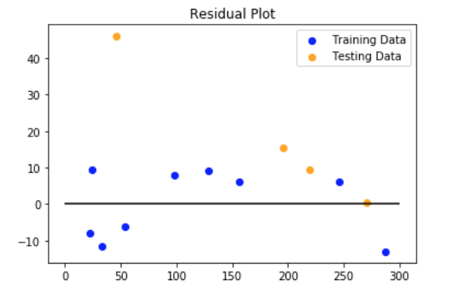

</details>

<sub>[Having issues with this activity? Report a bug!](https://bit.ly/2Vbp0Hf)</sub>

## 4. Data Preprocessing

| Activity Time:       0:45 |  Elapsed Time:      3:00  |
|---------------------------|---------------------------|

<details>
  <summary><strong> 📣 4.1 Instructor Do: Data Preprocessing (0:15) </summary></strong>


* This activity discusses several important data pre-processing techniques necessary for many machine learning algorithms.

  * The first big concept is how to convert text and categorical data to numeric features. Most algorithms cannot use features with string values, they must be converted to a numerical representation.

      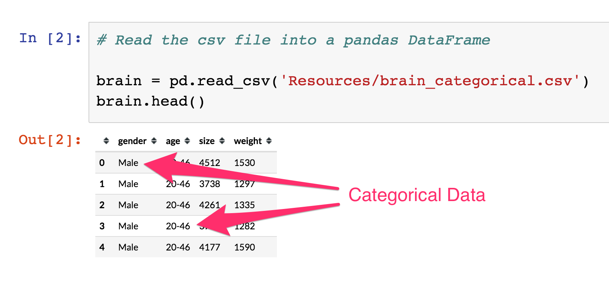

    * Label encoding is one approach where each category is encoded as an integer value. However, certain machine learning algorithms are sensitive to integer encoding.

      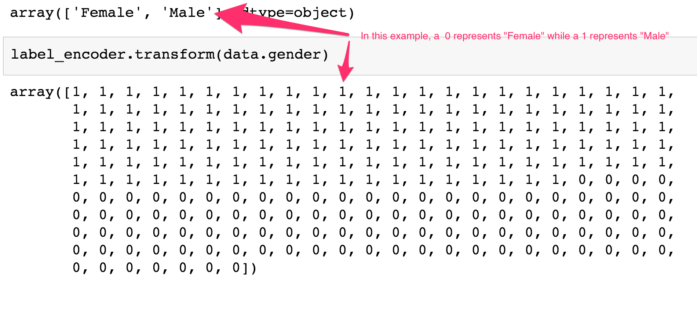

    * The Pandas `get_dummies` function should be sufficient for most situations and can be applied to the entire dataframe at once.

      * Explain that Pandas `get_dummies` function encodes each categorical variable into a series of columns - one column for each unique value in a categorical column

      * Point out that each row has one categorical column that is a one, all others are zero. This preprocessing transformation is known as `one-hot encoding`.

      * Caution students that when it comes to one-hot encoding we need to be careful that no two encoded columns are perfectly correlated, also known as `collinear`.

      * Explain that if two features are colinear, the model will get confused and weigh the categorical features more than other numerical features - this phenomenon is known as a `dummy trap`. Dummy traps are most likely to happen when encoding categorical features with two values (known as dichotomous or binary features).

      * Reassure students we can avoid the dummy trap by removing one encoded column for each categorical feature.

    * Note that in our example dataframe our gender column is considered to be a binary feature because there are only two options - male and female. In contrast the age column has many categorical "bins" that represent the different age groups.

      * In other words, the gender feature is more at risk of the dummy trap than the age feature.

  * The second big concept is scaling and normalization. The primary motivation for scaling is to shift all features to the same numeric scale so that large numerical values do not bias the error calculations during the training cycles.

    * It is recommended to split your data into training and testing data before fitting the scaling models. This is so that you do not bias your results by using the testing data to calculate the scale. The test data should be completely independent of the training step.

    * The Sklearn developers recommend using standard scaler when you do not know anything about your data.

      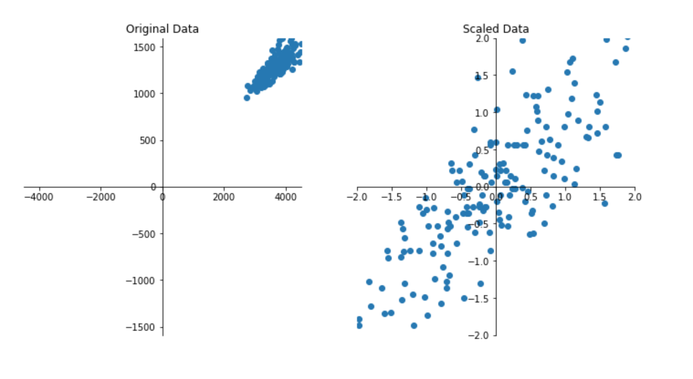

    * Another common scaling technique is MinMax scaling where values are scaled from 0 to 1.

      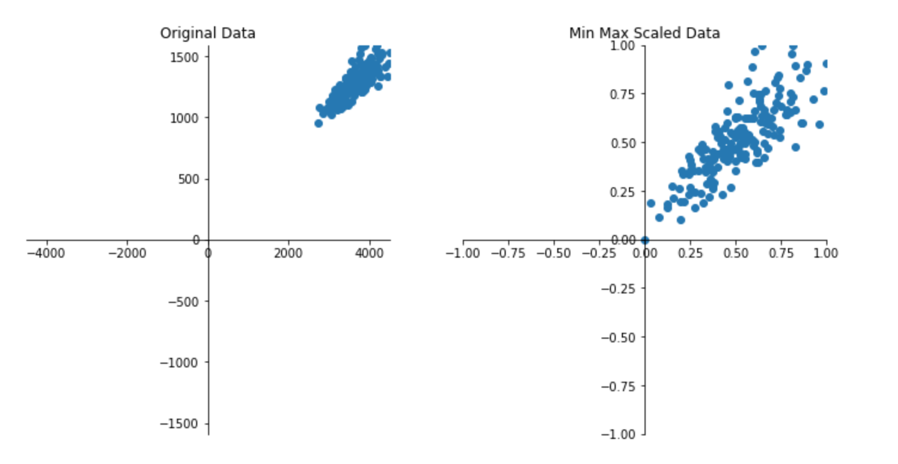

    * The only time that you may not want to scale is if the magnitudes of your input features has significance that needs to be preserved (i.e. Pixel values in the MNIST handwriting recognition dataset).

    * Note that scaling and normalization will often result in much more reasonable MSE values.

</details>

<details>
  <summary><strong> ✏️ 4.2 Students Do: Respiratory Disease (0:20)</summary></strong>

* **File**: [Stu_Respiratory_Disease.ipynb](Activities/08-Stu_Respiratory_Preprocessing/Unsolved/Stu_Respiratory_Disease.ipynb)

</details>

<details>
  <summary><strong> ⭐ 4.3 Review Activity (0:10)</summary></strong>

* Explain that our dataset has categorical values for the columns `sex` and `smoker`. We need to use the pandas `get_dummies` function to convert these to binary values.

  * Remind students that `get_dummies` will automatically create new columns for each category.

* Remind students that we need to fit our scaler model to the training data only. We do not use the testing data because we do not want to bias our scaler with the testing data.

  * Show that we can then apply the scaler model to our training and testing data.

* Explain that though we didn't explicitly cover `Lasso`, `Ridge`, and `ElasticNet`, these algorithms follow the same `model->fit->predict` pattern consistent with linear regression.

    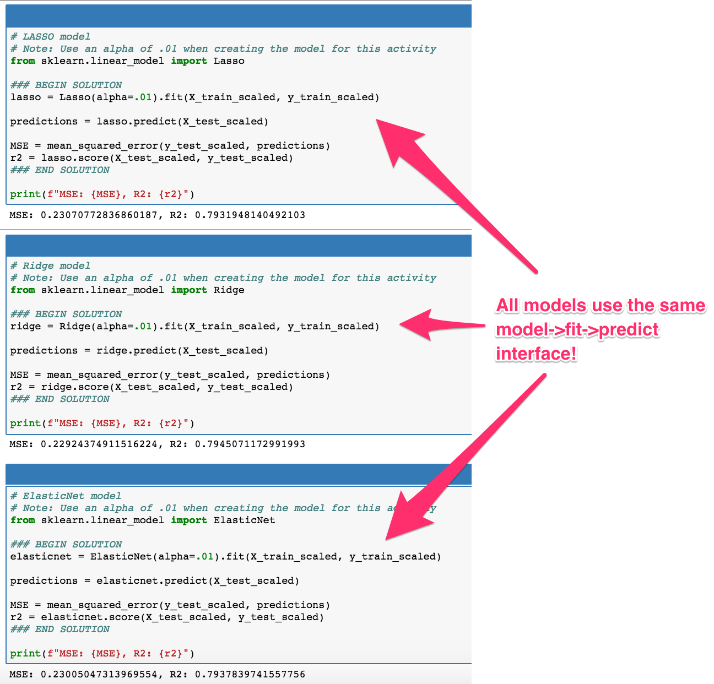

* Point out that all four of the models had similar performance for this particular dataset, but that may not always be the case. It's very common in machine learning to test several models on your dataset to see which model has the best performance. In this case, there were no significant advantages to using more complicated algorithms, so linear regression is probably still the best choice.

</details>

<sub>[Having issues with this activity? Report a bug!](https://bit.ly/3aTsOUh)</sub>

- - -

### Copyright

Trilogy Education Services © 2019. All Rights Reserved.
