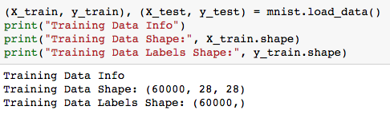
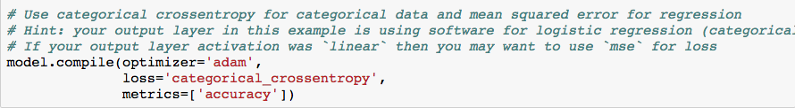
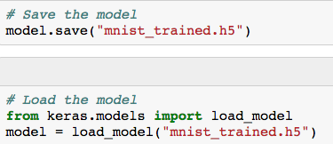
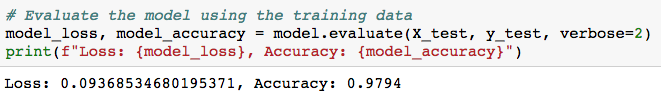
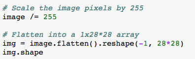

# 23.1 Final Projects

## Overview

This class will begin with an introduction to convolutional neural networks (CNN). The rest of the class will be devoted to project work.

## Class Objectives

* Students will familiarize themselves with the MNIST CNN example for handwriting recognition.

* Students will be able to load an image file into a data array.

* Students will be able to use pre-trained models to make predictions.

* Students will be able to use Google's Colab platform to create shared notebooks for machine learning.

* Students will make measurable progress with their project work.

## Instructor Prep

    
<strong>Instructor Notes</strong>

* As a reminder these slideshows are for instructor use only - when distributing slides to students, please first export the slides to a PDF file. You may then send out the PDF file.

* Please reference our [Student FAQ](../../../05-Instructor-Resources/README.md) for answers to questions frequently asked by students of this program. If you have any recommendations for additional questions, feel free to log an issue or a pull request with your desired additions.

* Be sure to remind students that if they choose to use AWS in any capacity to keep a close eye on the resources they are using as to not accrue any additional costs outside of the free tier services.

  
<strong>Sample Class Video</strong>

* To view an example class lecture visit (Note video may not reflect latest lesson plan): [Class Video](https://codingbootcamp.hosted.panopto.com/Panopto/Pages/Viewer.aspx?id=962b62be-0291-4c29-8a98-aa8900f90c73)

- - -

# Class Activities

## 1. MNIST Database

| Activity Time:       0:25 |  Elapsed Time:      0:25  |
|---------------------------|---------------------------|

    
<strong>🎉 1.1 Everyone Do: MNIST (25 mins)</strong>

* Open [01-Evr_MNIST/MNIST.ipynb](Activities/01-Evr_MNIST/Solved/MNIST.ipynb) for reference.  Send out [01-Evr_MNIST/MNIST.ipynb](Activities/01-Evr_MNIST/Unsolved/MNIST.ipynb) and live code the solution with the students. Make sure to pause frequently to ask for questions and allow them to keep up.

  * First, explain that this activity will build deep learning model capable of recognizing handwritten digits. This is considered the `Hello World` of deep learning with many examples and tutorials available online.

  * Load the MNIST handwriting dataset from Keras.  The dataset includes 60,000 grayscale handwritten numbers.

  

  * Show the first digit from the dataset using matplotlib to plot the image.

  

  * Explain that these images consist of arrays of pixel values where a value of `0` represents all white while a value of `255` represents all black.

  

  * The images must be reshaped from 28x28 pixels to a 1 dimensional array of 784 pixels. Imagine taking the top left and bottom right corners of our image and stretching the image out into a single array of pixels.

  

  * After reshaping the pixel values, apply `MinMaxScaler`.  `MinMaxScaler` scales the data from 0 to 1.  In this example, 0 will represent all white and 1 all black.

  * Then, apply `one-hot-encoding` to the y labels. In this dataset, the labels are the digits `0-9`.  This converts the label to a binary representation of the digit (i.e. an array of `[0,0,0,0,1,0,0,0,0]` represents the digit `5`).

  

  * Finally, construct the deep learning model. For this example, use two hidden layers of 100 nodes each, and an output layer with 10 nodes (one for each digit).

  
  
  

  * Then, compile and fit the model to the data.

  
  

  * Save our trained model for later use in today's class.

  

  * Show that the accuracy of the model using the test data is extremely high.

  

  * Now, use the trained model to make predictions.

  * Choose a data point to predict.  `np.expand_dims` converts the input data from a shape of (,784) to (1, 784) as Keras expects.

  * Show that `model.predict()` can be used to obtain a prediction in the `one-hot-encoded` format, while `model.predict_classes()` will automatically convert from the `one-hot-encoding` to the original integer encoding.

  

  * Next, import a custom image using keras.  Setting the `target_size` parameter as the image size will resize the image to be consistent with the image sizes with which the model was trained. Import it as a grayscale image.

  * Resize the image to the size the model was trained on, 28x28 pixels, and then convert the image to an array.

  

  * Show that instead of `MinMaxScaler` the data is manually scaled using `image /= 255`.

  * The image data must be reshaped into a 1 dimensional array before using the model.

  

  * The original data is black digits on a white backgrounds, but the custom image is inverted. Simple subtraction, `img = 1 - img`, will invert the pixels.

  

  * Finally, a prediction can be made.

  

  * Take some extra time to answer any questions before moving on.

[Having issues with this activity? Report a bug!](https://bit.ly/3e7BWq8)

## 2. Google Colab

| Activity Time:       0:20 |  Elapsed Time:      0:45  |
|---------------------------|---------------------------|

    
<strong> ✏️ 2.1 Students Do: Google Colab (20 mins)</strong>

* **Files:** [Activities/02-Stu_Google_Colab](Activities/02-Stu_Google_Colab)

* In this activity, students will follow the guide to explore creating and sharing Jupyter notebooks on Google Colab, a cloud platform oriented toward machine learning.

* Explain that Google Colab is a great way to share Machine Learning notebooks with potential employers.

[Having issues with this activity? Report a bug!](https://bit.ly/2yKZLnE)

## 3. Final Projects

| Activity Time:       2:15 |  Elapsed Time:      4:00  |
|---------------------------|---------------------------|

    
<strong> 📣 3.1 Instructor Do: Intro to Final Projects (15 mins)</strong>

* **Slides:** [Slideshow](https://drive.google.com/open?id=13MTrvlyoveqJrF4F4008z0l7N41R6Lc06YAMgsyA39k)

* Introduce students to the final project requirements.

* Answer any questions before moving on.

    
<strong> ✏️ 3.2 Students Do: Project Work (120 mins)</strong>

* Send out the [Heroku deployment guide](Heroku_Deployment) (from project 2) for students to use as reference for a potential option to deploy their application.

* For students that may plan on using MongoDB as their data source send out the following links for getting set up with mLab.

  * [Deploy to Heroku with Mongo](https://jasonwatmore.com/post/2018/12/06/deploy-to-heroku-node-mongo-api-for-authentication-registration-and-user-management#install-mongodb-addon)

  * [How to deploy your Mongo app](https://medium.com/make-school/how-to-deploy-your-node-js-mongodb-app-to-the-web-using-heroku-63d4bccf2675)

* **Important:** warn students that if they choose to use any AWS resources to closely monitor what they use. Remind them to clean up and stop or shutdown any resources they may choose to use as to not accrue any additional costs.

* Send out the [AWS Billing Check](AWS_check_billing.pdf) that instructs students how to double their billing costs.

* Students will spend the rest of the class working on their projects.

- - -

### Copyright

Trilogy Education Services © 2019. All Rights Reserved.
