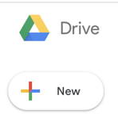
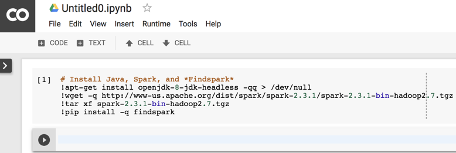
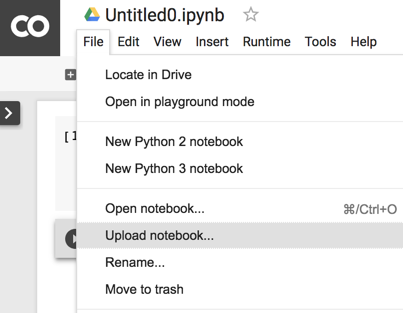
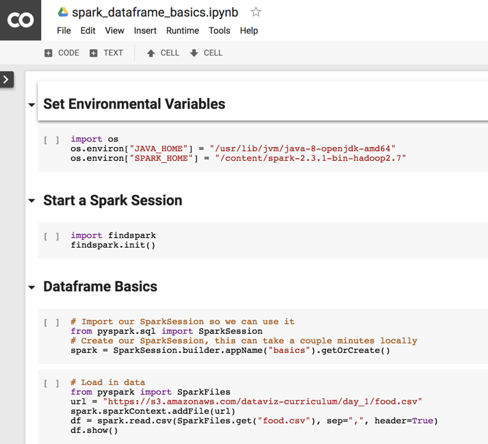
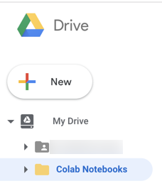
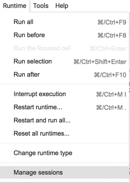

## Installing Google Colaboratory

* As a backup incase of ZEPL issues Google's Colab notebooks can be used to run the activities and demonstrate results. This guide will get you up and running with Google Colab Notebooks.

* Navigate to the [Google Drive](https://www.google.com/drive/) and click **Go to Google Drive**.

* Once inside the drive click the plus sign on the left hand side.

  

* From the menu scroll down to more the click **Connect more apps**.

  

* In the menu that pops up search `colab` in the top right and hit enter to search for the `Colaboratory` app.

  

* Download the app but clicking `CONNNECT`.

* You can create new notebooks from the main menu by clicking new, then more and selecting `Colaboratory`.

  

* This will create a Colab Notebook.

* To use pySpark some files need to be downloaded. Run the following command in any cell by hitting `SHIFT+ENTER` to install dependencies. **Note** this will be included in every notebook.

```python
# Install Java, Spark, and *Findspark*
!apt-get install openjdk-8-jdk-headless -qq > /dev/null
!wget -q http://www-us.apache.org/dist/spark/spark-2.3.2/spark-2.3.2-bin-hadoop2.7.tgz
!tar xf spark-2.3.2-bin-hadoop2.7.tgz
!pip install -q findspark
```

  

### Importing Notebooks

* Colab allows users to easily import existing notebooks.

* From the notebook click `File` then `Upload notebook`.

  

* Drag the notebook file you wish to upload into the box that pops up and Colab will do the rest.

* Note there is some added code that sets environmental variables and finds Spark. These are all provided and specific to having Google Colab run Spark.

* The notebooks will run just the same as any other.

  

* All uploaded notebooks can be found in the **Colab Notebooks** folder under **My Drive** in the main page of Google Drive.

  

## Handling Memory Issues

* Google Colab does have a memory limit, if the following warning pops up follow the steps to terminate old sessions.

  

* **Option 1:** Handle from the memory screen.

  * Click Manage Sessions.

  

  * Click `Terminate Other Sessions`.

  

* **Option 2:** Manage Session from toolbar

  * Click `Runtime` then `Manage Sessions`

  

  * Click `Terminate Other Sessions`.

  
